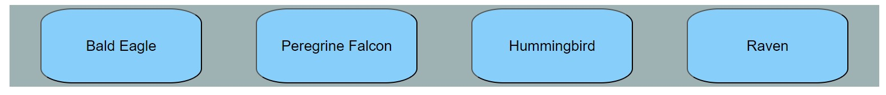
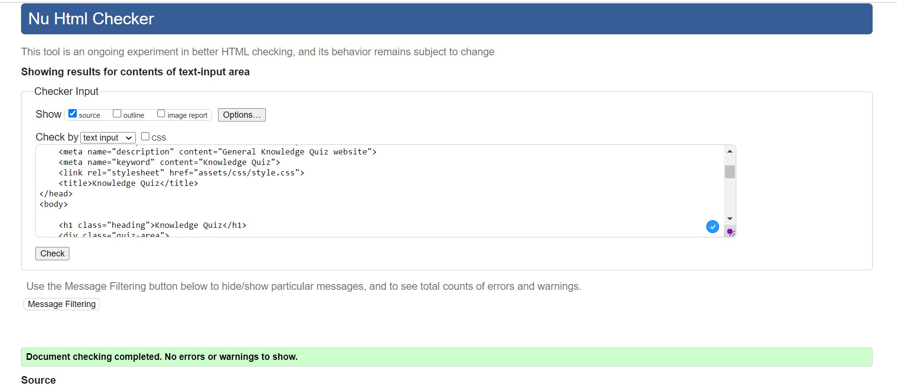

# Knowledge Quiz
## Features
## Existing Features
- The Knowledge Quiz Heading
## Result Area

## Question Area

## Options Area

## Evaluate Area

## Testing

- I tested this page working different browsers: Chrome, Firefox, and Safari.

- I confirmed that this project is responsive, looks good, and functions on all standard screen sizes using the devtools device toolbar.

## Validator Testing 

- HTML
     No errors were returned when passing through the official W3C validator
- CSS
     No errors were found when passing through the official (Jigsaw) validator
- JavaScript
     No errors were found when passing through the official Jshint validator

- ACCESSIBILITY 
     I confirmed that the colors and fonts chosen are easy to read and accessible by running it through lighthouse in devtools

## Bugs

## Version Control

- GitHub

- Gitpod

Gitpod served as the local repository and IDE. GitHUb served as the remote repository.

The following steps were followed to maintain version control

- I created a repository on GitHub and named it 'knowledge quiz'

- I then signed in to Gitpod and opened a new workspace via the repository name 'knowledge quiz'

- I created the pages, folders and files on GitPod

- I saved my work on GitPod at regular intervals and pushed it to GitHub to keep it safe
This is the process I followed having completing each significant section of code, I typed the following into the terminal:

- git add . (This added the work to git)

- git commit -m "COMMIT MESSAGE" (This committed the work)

- git push (This pushed the work to GitHub)

## Deployment

- The site was deployed to GitHub pages. The steps to deploy are as follows:

- In the GitHub repository, navigate to the Settings tab

- From the source section drop-down menu, select the Master Branch

- Once the master branch has been selected, the page will be automatically refreshed with a detailed ribbon display to indicate the successful deployment.

- The live link can be found here - 

## Technologies used

- [HTML5](https://en.wikipedia.org/wiki/HTML) for markup

- [CSS3](https://en.wikipedia.org/wiki/CSS) for style

- [Github](https://github.com/) to keep the file

- [Gitpod](https://www.gitpod.io/) for version control

## Content 

- Home page text was taken from Wikipedia and Google

