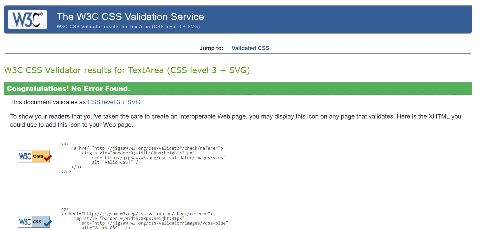
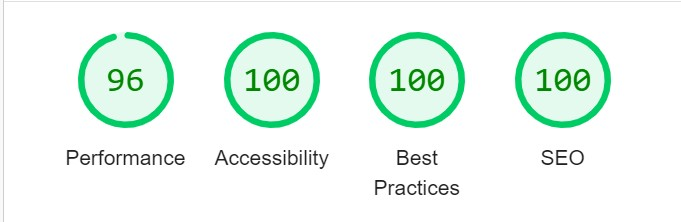

# Knowledge Quiz
## Features

A knowledge quiz is a type of quiz that tests someone's knowledge on a particular subject or a wide range of topics. These quizzes can be conducted in various settings, including classrooms, online platforms, and even in casual settings among friends or family members. The questions can cover a variety of topics such as history, science, geography, literature, pop culture, and more. The goal of a knowledge quiz is to assess how much a person knows about a particular subject or a range of topics and to provide them with score and feedback on their level of knowledge.

## Existing Features
- The Knowledge Quiz Heading

The existing features of a knowledge quiz may vary depending on the platform or application used to conduct the quiz. However, some common features of a knowledge quiz include:

Multiple Choice Questions - These questions provide a list of possible answers to choose from, with only one being the correct answer.

True or False Questions - These questions require the participant to determine if the statement presented is true or false.

Fill in the Blank Questions - These questions provide a sentence or statement with one or more blanks, and the participant has to fill in the missing word or phrase.

Score Tracking - The participant's score is typically displayed at the end of the quiz to provide feedback on their performance.

Answer Tracking - Once the participant clicks the evaluate button, he can see if the answer is correct or incorrect on the display, so he can see what he needs to do.

## Result Area

The "result area" in a quiz typically refers to the section of the quiz that provides the quiz-taker with their final score or results after they have completed the quiz.

For example, after the quiz-taker has answered all the questions, the result area may display their score, along with any other relevant information, such as the number of questions answered correctly and incorrectly, the time it took to complete the quiz, or a breakdown of their performance on different sections or topics within the quiz.

The result area may also provide feedback or suggestions for improvement based on the quiz-taker's performance, such as links to additional resources or recommendations for further study.

It is important for the result area to be clear and easy to understand, with accurate and informative feedback that helps the quiz-taker to learn and improve. The result area should also be visually appealing and engaging, using graphics or other elements to enhance the quiz-taker's experience and encourage them to continue learning.

## Question Area

The "question area" in a quiz typically refers to the section of the quiz that presents the quiz-taker with a question or a prompt that they need to respond to.

For example, if a quiz is testing the quiz-taker's knowledge of world geography, a question area might display a prompt such as: "What is the capital of Brazil?"

The question area may include various types of questions, such as multiple-choice, true/false, fill-in-the-blank, or short answer questions. Depending on the quiz format or platform, the question area may also include images, graphs, or other multimedia elements to enhance the quiz-taker's understanding of the question.

It is important for the question area to be clear and concise, with well-written questions that accurately reflect the content and difficulty level of the quiz. The question area should also be easy to navigate, allowing the quiz-taker to move forward questions as needed.

## Options Area

The "options area" in a quiz typically refers to the section of the quiz where the answer choices are provided for each question.

For example, if a quiz question asks, "What is the capital of France?", the options area would provide the answer choices, such as:

A. Paris
B. Madrid
C. Berlin
D. London

The quiz-taker would then choose the correct answer by selecting the corresponding letter or option.

The options area may be located directly below or next to the quiz question, depending on the quiz format or platform. It is important for the options area to be clear and easy to understand, with distinct and unambiguous answer choices.

## Evaluate Area

The "evaluate area" in a quiz typically refers to the section of the quiz where the quiz-taker receives feedback on their answers, indicating whether their answer was correct or incorrect.

For example, after answering a quiz question, the quiz-taker may be directed to an evaluate area where a message is displayed indicating whether their answer was correct or not. The evaluate area may also include an explanation or additional information about the correct answer, to help the quiz-taker understand why their answer was right or wrong and score display.

The evaluate area may be located below the options area or on a separate page, depending on the quiz format or platform. It is important for the evaluate area to be clear and informative, helping the quiz-taker to learn and improve their knowledge based on the feedback they receive.

## Resources

-	[CodeInstitute](https://codeinstitute.net/de/) – Course material

-	[CodeInstitute](https://codeinstitute.net/de/) – Slack community

-	[W3Schools](https://profile.w3schools.com/log-in?redirect_url=https%3A%2F%2Fwww.w3schools.com%2F) - helped me in researching and fixing errors along the way

-	[AmIResponsive](https://ui.dev/amiresponsive) – Check the sites responsiveness

-	[W3CValidate](https://validator.w3.org/) - HTML code

-	[W3CCSS](https://jigsaw.w3.org/css-validator/) - CSS Validation

-    [JSHint](https://jshint.com/) - JsHint a javascript code quality tool

## Testing

- I tested this page working different browsers: Chrome, Firefox, and Safari.

- I confirmed that this project is responsive, looks good, and functions on all standard screen sizes using the devtools device toolbar.

## Validator Testing 

- HTML
     No errors were returned when passing through the official W3C validator
- CSS
     No errors were found when passing through the official (Jigsaw) validator
- JavaScript
     No errors were found when passing through the official Jshint validator

- ACCESSIBILITY 
     I confirmed that the colors and fonts chosen are easy to read and accessible by running it through lighthouse in devtools

     

## Bugs Fixed

A bug was found in the evaluate button after reaching the sixth question, the user can change the option and re-evaluate the score so I had to disable the evaluate button after reaching the sixth question

Title: Evaluate button remains disabled after closing iteration popup on question 6

Description: When answering questions in the quiz, after reaching question number 6, a popup iteration is shown. When the user closes the iteration popup, the Evaluate button remains disabled and cannot be clicked to submit the answer. This behavior is unexpected as the Evaluate button should become enabled after the iteration popup is closed.

Steps to reproduce:

- Navigate to the quiz.
- Begin answering questions until reaching question 6.
- Observe that a popup iteration is shown.
- Close the iteration popup.
- Observe that the Evaluate button remains disabled.

Expected result: The Evaluate button becomes enabled after closing the iteration popup on question 6.

Actual result: The Evaluate button remains disabled after closing the iteration popup on question 6.

Severity: Medium - this issue prevents users from submitting their answers and completing the quiz, but it does not affect the functionality of the quiz for earlier questions.

Priority: High - this issue affects a critical part of the quiz and should be fixed as soon as possible to avoid user frustration and potential loss of data.

## Version Control

- GitHub

- Gitpod

Gitpod served as the local repository and IDE. GitHUb served as the remote repository.

The following steps were followed to maintain version control

- I created a repository on GitHub and named it 'knowledge quiz'

- I then signed in to Gitpod and opened a new workspace via the repository name 'knowledge quiz'

- I created the pages, folders and files on GitPod

- I saved my work on GitPod at regular intervals and pushed it to GitHub to keep it safe
This is the process I followed having completing each significant section of code, I typed the following into the terminal:

- git add . (This added the work to git)

- git commit -m "COMMIT MESSAGE" (This committed the work)

- git push (This pushed the work to GitHub)

## Deployment

- The site was deployed to GitHub pages. The steps to deploy are as follows:

- In the GitHub repository, navigate to the Settings tab

- From the source section drop-down menu, select the Master Branch

- Once the master branch has been selected, the page will be automatically refreshed with a detailed ribbon display to indicate the successful deployment.

- The live link can be found here -  [Knowledge-Quiz](https://anthonyrajlucas.github.io/knowledge-quiz/)

## Technologies used

- [HTML5](https://en.wikipedia.org/wiki/HTML) for markup

- [CSS3](https://en.wikipedia.org/wiki/CSS) for style

- [Github](https://github.com/) to keep the file

- [Gitpod](https://www.gitpod.io/) for version control

## Content 

- Home page text was taken from Wikipedia and Google

